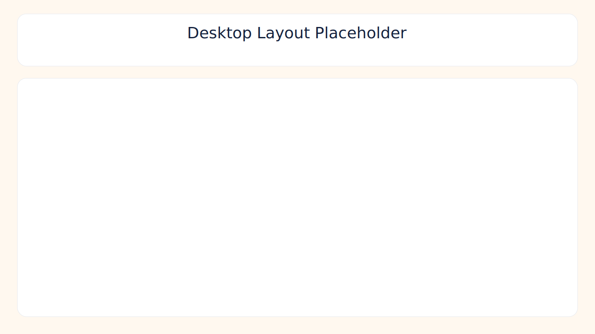
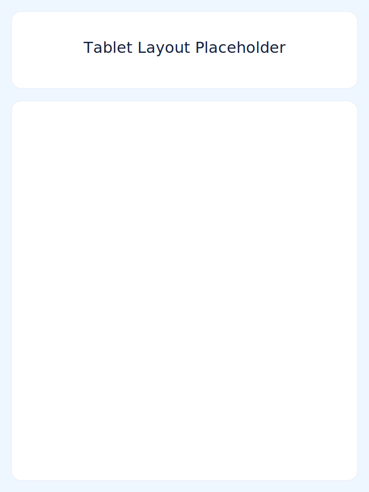
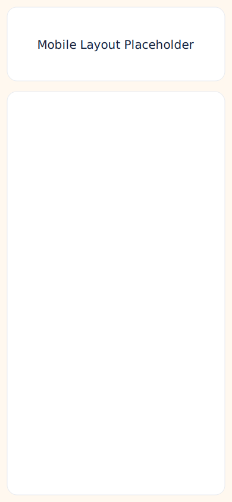

# Recipe Management System (Version 3)

Full-stack Recipe Management System built with:
- Frontend: React + Vite
- Backend: Node.js + Express
- Database: PostgreSQL (Render Postgres)
- ORM: Prisma
- Auth: Email/password (signup + login) with optional Google SSO (Passport OAuth2)
- PWA: Installable web app (manifest + service worker + install prompt)

## Feature Checklist

- Recipe CRUD with metadata: cuisine, prep/cook time, servings, difficulty, tags
- Status tagging: `FAVORITE`, `TO_TRY`, `MADE_BEFORE`
- Search and filters: name, ingredient, cuisine, prep time, scope (`mine`/`shared`/`all`)
- Multi-user support and sharing (viewer/editor permissions)
- Recipe reviews with 1-5 rating and comments
- Pantry CRUD per user
- Import up to 100 free recipes from TheMealDB into your account
- AI cooking assistant:
  - what can cook now
  - almost cook (missing ingredients)
  - substitutions
  - shopping list
- AI metadata auto-fill for draft recipes (DeepSeek first, OpenAI fallback)
- AI dish image generation with fallback placeholder
- Graceful fallback when AI keys are missing
- Mobile/tablet/desktop responsive UI
- PWA install prompt + offline shell caching

## Repository Layout

- `client/` React + Vite app
- `server/` Express API + Prisma
- `render.yaml` Render blueprint (client + server + postgres)
- `docs/screenshots/` README screenshots

## Local Setup

### 1) Install dependencies

```bash
npm install
```

### 2) Configure environment

Backend:

```bash
copy server\.env.example server\.env
```

Frontend:

```bash
copy client\.env.example client\.env
```

### 3) Update key backend env vars (`server/.env`)

- `DATABASE_URL`
- `SESSION_SECRET`
- `CLIENT_URL` (e.g. `http://localhost:5173`)
- `SERVER_URL` (e.g. `http://localhost:4000`)
- `GOOGLE_CLIENT_ID` (optional if only email/password auth is used)
- `GOOGLE_CLIENT_SECRET` (optional if only email/password auth is used)
- Optional AI (priority order):
  - `DEEPSEEK_API_KEY` (primary for text features)
  - `DEEPSEEK_TEXT_MODEL`
  - `DEEPSEEK_BASE_URL`
  - `OPENAI_API_KEY` (fallback + image generation)
  - `OPENAI_TEXT_MODEL`
  - `OPENAI_IMAGE_MODEL`
- Optional local dev auth helper:
  - `ALLOW_DEV_AUTH=true`

### 4) Prisma generate + migrate

```bash
npm run prisma:generate --workspace server
npm run prisma:migrate --workspace server
```

### 5) Run app

```bash
npm run dev
```

- Client: `http://localhost:5173`
- Server: `http://localhost:4000`

## Google OAuth Setup (Optional)

Create OAuth credentials in Google Cloud Console only if you want Google SSO as option 2 on login:

- Authorized JavaScript origins:
  - `http://localhost:5173`
  - `https://<your-client>.onrender.com`
- Authorized redirect URIs:
  - `http://localhost:4000/api/auth/google/callback`
  - `https://<your-server>.onrender.com/api/auth/google/callback`

## Render Deployment (Client + Server + Postgres)

This repo includes `render.yaml` for Blueprint deploy.

### Option A: Blueprint (recommended)

1. Push this repo to GitHub.
2. In Render, create Blueprint from repo.
3. Render provisions:
   - `rms-postgres` (free postgres)
   - `rms-server` (Node web service)
   - `rms-client` (static site)
4. Fill missing secret env vars in Render dashboard:
   - `GOOGLE_CLIENT_ID`
   - `GOOGLE_CLIENT_SECRET`
   - optional `OPENAI_API_KEY`
5. Update OAuth redirect URIs to your Render URLs (if Google SSO is enabled).

### Option B: Manual services

Create services manually and use commands:

Server build:

```bash
npm install && npm run prisma:generate && npm run build
```

Server start:

```bash
npm run prisma:deploy && npm run start
```

Client build:

```bash
npm install && npm run build
```

Static publish directory:

```txt
dist
```

## Scripts

Root:

- `npm run dev` - run client + server
- `npm run build` - build server + client
- `npm run lint` - lint server + client
- `npm run test` - run backend tests

Server:

- `npm run prisma:generate --workspace server`
- `npm run prisma:migrate --workspace server`
- `npm run prisma:deploy --workspace server`
- `npm run dev:seed --workspace server`

## PWA Notes

- Manifest + service worker generated by `vite-plugin-pwa`
- Install banner appears on supported browsers after `beforeinstallprompt`
- Core app shell is cached for offline entry
- API calls still require network access

## Testing and Quality

Executed successfully:

- `npm run build`
- `npm run lint`
- `npm run test`

Backend tests cover:

- AI fallback cooking logic
- metadata/image fallback behavior
- permissions helpers
- auth/me and health endpoints

## API Summary

- `GET /api/health`
- `GET /api/auth/me`
- `POST /api/auth/signup`
- `POST /api/auth/login`
- `GET /api/auth/google`
- `GET /api/auth/google/callback`
- `POST /api/auth/logout`
- `POST /api/auth/dev-login` (only when `ALLOW_DEV_AUTH=true`)
- `GET/POST/PUT/DELETE /api/recipes`
- `POST /api/recipes/import/free?count=100`
- `GET /api/recipes/:id/reviews`
- `POST /api/recipes/:id/reviews`
- `POST /api/recipes/:id/share`
- `DELETE /api/recipes/:id/share/:userId`
- `GET /api/recipes/:id/shares`
- `GET/POST/PUT/DELETE /api/pantry`
- `POST /api/ai/cook-now`
- `POST /api/ai/metadata`
- `POST /api/ai/recipes/:id/generate-image`

## Screenshots

### Desktop



### Tablet



### Mobile



## Known Limitations

- Live Render URLs are not included because deployment requires your Render account and secrets.
- Free Render Postgres has lifecycle/storage limits.
- Session storage uses default in-memory store; use Redis-backed session store for hardened production sessions.
- Current tests focus on core logic and selected endpoints; full DB integration tests can be added with a test Postgres container.

